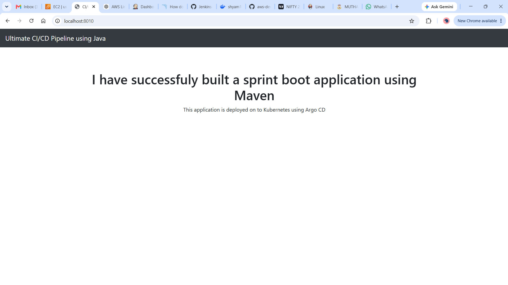
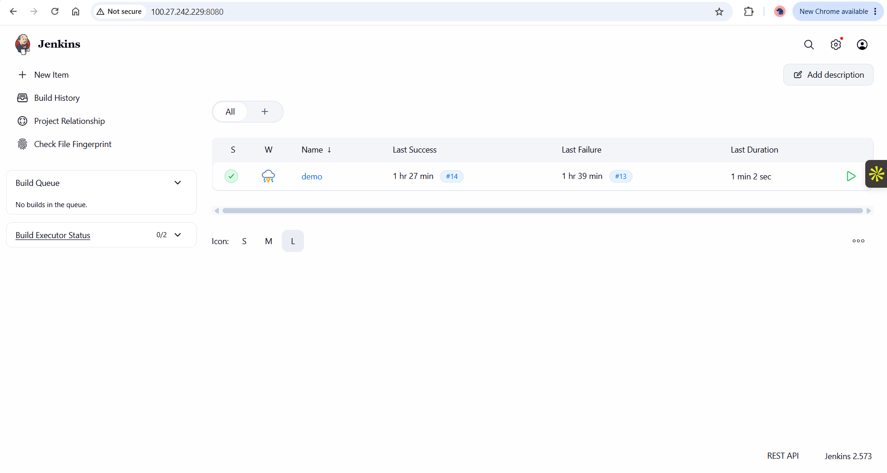
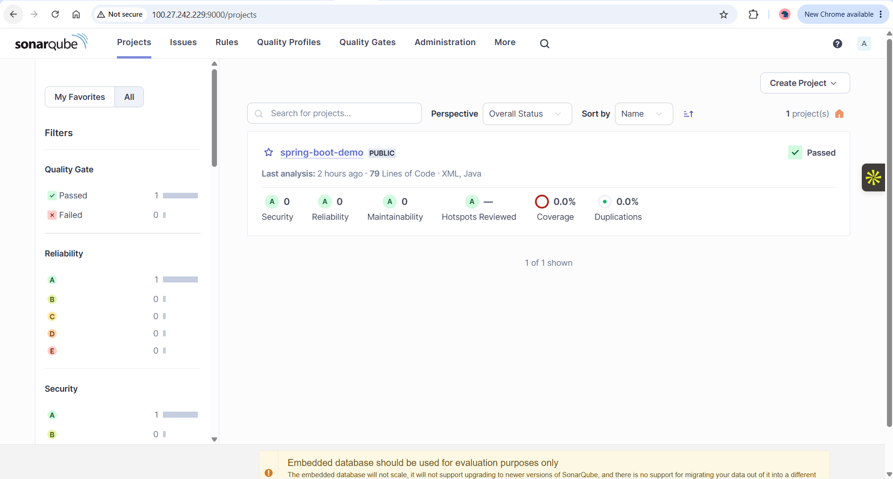
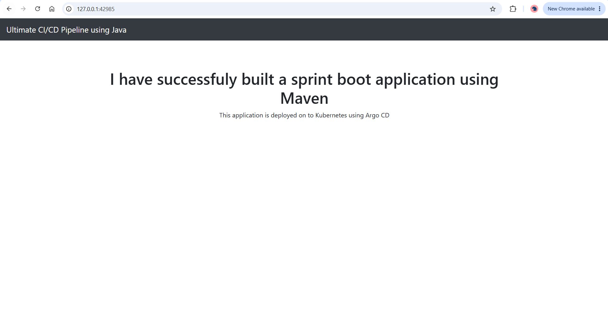

# 🚀 End-to-End CI/CD Pipeline with Jenkins, Docker, Kubernetes & Argo CD

## 📌 Project Overview

This project demonstrates a complete DevOps CI/CD pipeline that automates the build, testing, containerization, and deployment of a Spring Boot application using modern DevOps tools and GitOps practices.

The application source code is hosted on GitHub. Jenkins continuously integrates the application, performs code quality analysis using SonarQube, builds a Docker image, pushes it to Docker Hub, and finally deploys the application to a Kubernetes cluster using Argo CD.

---

## 🎯 Objective

The objective of this project is to understand and implement an industry-standard CI/CD workflow by integrating:

- Git & GitHub
- Jenkins
- Maven
- SonarQube
- Docker
- Docker Hub
- Kubernetes (Minikube)
- Argo CD
- AWS EC2 (Jenkins Server)

---

## 🏗️ Project Architecture

```
        Developer
            │
            ▼
        GitHub Repository
            │
            ▼
      Jenkins (AWS EC2)
            │
            ├────────────► Maven Build
            │
            ├────────────► SonarQube Analysis
            │
            ├────────────► Docker Build
            │
            └────────────► Push Docker Image
                           │
                           ▼
                      Docker Hub
                           │
                           ▼
                    Kubernetes Cluster
                      (Minikube)
                           ▲
                           │
                      Argo CD (GitOps)
                           │
                           ▼
                Deploy Spring Boot Application
```

### Workflow

1. Developer pushes code to GitHub.
2. Jenkins automatically detects the changes.
3. Maven builds the Spring Boot application.
4. SonarQube performs static code quality analysis.
5. Jenkins builds a Docker image.
6. Docker image is pushed to Docker Hub.
7. Kubernetes deployment files stored in GitHub are monitored by Argo CD.
8. Argo CD automatically synchronizes the Kubernetes cluster with the latest manifests.
9. Spring Boot application is deployed successfully inside Kubernetes.

## 🛠️ Technologies Used

| Technology | Purpose |
|------------|---------|
| AWS EC2 | Hosted Jenkins Server |
| Git | Version Control |
| GitHub | Source Code Repository |
| Jenkins | Continuous Integration & Continuous Delivery |
| Maven | Build Automation Tool |
| SonarQube | Static Code Quality Analysis |
| Docker | Containerization |
| Docker Hub | Container Image Registry |
| Kubernetes (Minikube) | Container Orchestration |
| Argo CD | GitOps Continuous Deployment |
| Java 17 | Spring Boot Application Development |
| Spring Boot | Backend Application Framework |
| Linux (Ubuntu) | Server Environment |
| kubectl | Kubernetes Command Line Tool |
| Minikube | Local Kubernetes Cluster |

## 🚀 End-to-End CI/CD Workflow

### 1️⃣ Source Code Management
- Developer writes code in Spring Boot.
- Source code is pushed to GitHub repository.

### 2️⃣ Continuous Integration using Jenkins
- Jenkins monitors the GitHub repository.
- Whenever a new commit is pushed, Jenkins automatically triggers the pipeline.

### 3️⃣ Build Stage
- Jenkins uses Maven to download dependencies.
- The Spring Boot application is compiled.
- Unit tests are executed.
- A JAR file is generated.

### 4️⃣ Code Quality Analysis
- Jenkins performs static code analysis using SonarQube.
- The project quality is validated before deployment.

### 5️⃣ Docker Image Creation
- Jenkins builds a Docker image using the Dockerfile.
- The application is packaged into a container.

### 6️⃣ Push Image to Docker Hub
- The Docker image is tagged.
- Jenkins pushes the image to Docker Hub.

### 7️⃣ Update Kubernetes Manifest
- Jenkins updates the Kubernetes deployment manifest with the latest Docker image tag.
- The updated manifest is pushed back to GitHub.

### 8️⃣ GitOps Deployment using Argo CD
- Argo CD continuously monitors the GitHub repository.
- Once a new commit is detected, Argo CD automatically synchronizes the Kubernetes cluster.

### 9️⃣ Kubernetes Deployment
- Kubernetes pulls the latest Docker image.
- New pods are created.
- Service exposes the application.

### 🔟 Application Available
- The Spring Boot application becomes available through the Kubernetes Service.

## 📸 Project Screenshots

### AWS EC2 Instance (Jenkins Server)


---

### Spring Boot Application Running Locally


---

### Jenkins CI/CD Pipeline


---

### SonarQube Code Quality Analysis


---

### Docker Image Published to Docker Hub


---

### Argo CD Deployment Dashboard


---

### Spring Boot Application Running on Kubernetes


## ✨ Key Features

- ✅ End-to-End CI/CD Pipeline Implementation
- ✅ Automated Build using Jenkins
- ✅ Maven Build & Dependency Management
- ✅ Static Code Analysis with SonarQube
- ✅ Docker Image Creation and Versioning
- ✅ Docker Hub Integration
- ✅ Automated Kubernetes Deployment
- ✅ GitOps Workflow using Argo CD
- ✅ Self-Healing Kubernetes Deployments
- ✅ Continuous Synchronization with Git Repository
- ✅ Spring Boot Microservice Deployment
- ✅ High Availability using Multiple Kubernetes Pods

## 📚 Learning Outcomes

Through this project, I gained practical hands-on experience in:

- Building a complete CI/CD pipeline using Jenkins
- Automating application builds with Maven
- Performing static code analysis using SonarQube
- Creating and managing Docker images
- Publishing Docker images to Docker Hub
- Deploying containerized applications on Kubernetes
- Implementing GitOps deployment using Argo CD
- Managing Kubernetes Deployments and Services
- Troubleshooting real-world DevOps issues across Jenkins, Docker, Kubernetes, and Argo CD
- Understanding the end-to-end software delivery lifecycle

## 🚀 Future Improvements

- Integrate automated testing into the pipeline
- Deploy on Amazon EKS instead of Minikube
- Implement Helm Charts for Kubernetes deployments
- Configure monitoring using Prometheus and Grafana
- Add Slack or Email notifications from Jenkins
- Implement Kubernetes Ingress with a custom domain

## 👨‍💻 Author

**Shyam S**

- GitHub: https://github.com/Shyamm12
- LinkedIn: https://linkedin.com/in/shanmugapriyan12
